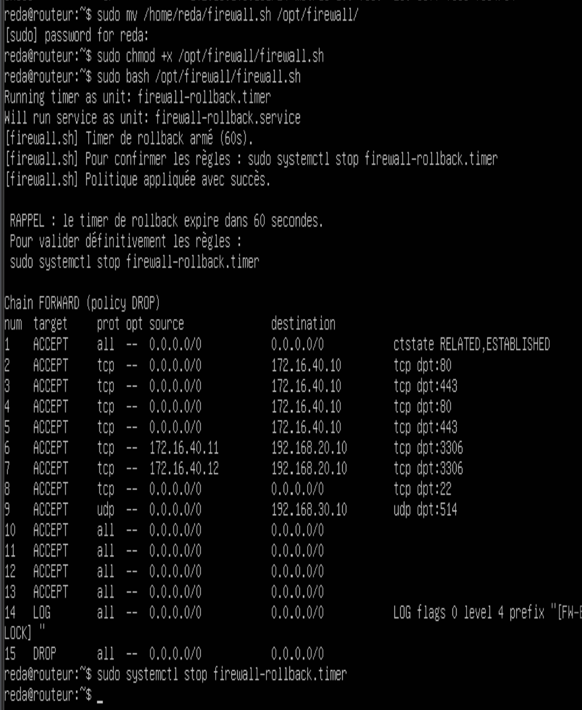
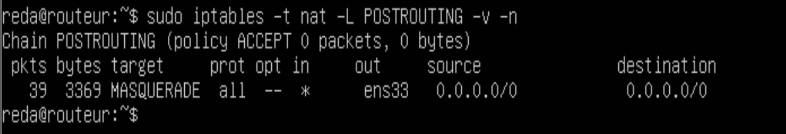
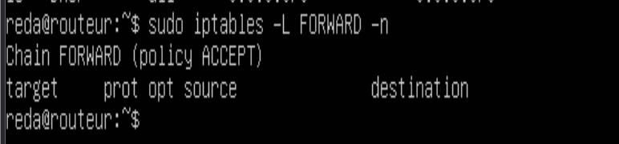
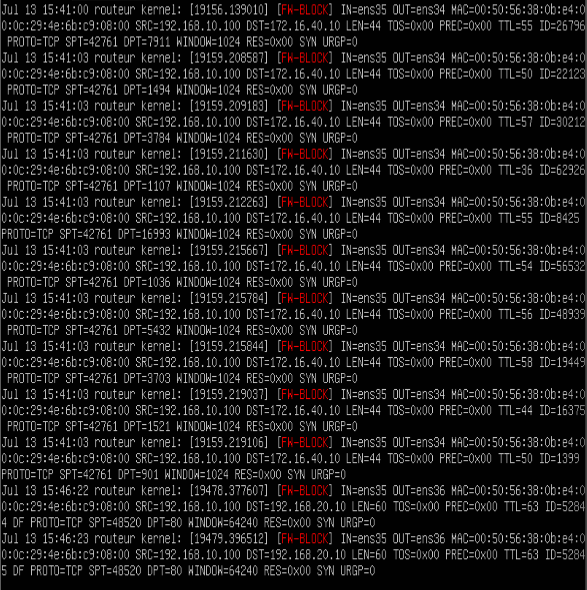
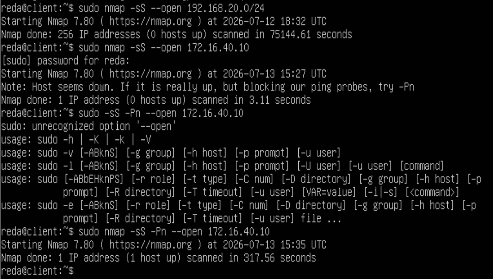

# Phase 03 — Stateful Firewall Policy (`firewall.sh`)

> Implementation of the default-deny inter-zone filtering policy on the central
> router-firewall, with idempotent Bash automation and a systemd-based rollback
> safety mechanism. Gate 2 validation.

---

## Table of Contents

- [Objective](#objective)
- [Design Principles](#design-principles)
- [Script Architecture](#script-architecture)
- [Firewall Rules — Detailed Breakdown](#firewall-rules--detailed-breakdown)
- [Rollback Mechanism](#rollback-mechanism)
- [Challenges and Resolutions](#challenges-and-resolutions)
- [Gate 2 Validation](#gate-2-validation)
- [Outcome](#outcome)

---

## Objective

Transform the permissive Layer 3 router validated in Phase 02 into a stateful
firewall enforcing the inter-zone traffic matrix defined in the project specification
(CDC §5.3). All filtering logic is encapsulated in a single idempotent Bash script
(`firewall.sh`) that can be safely re-executed without producing orphaned rules or
inconsistent state.

---

## Design Principles

**Default-deny (least privilege at network level)**
The FORWARD chain policy is set to DROP. Every inter-zone flow that is not explicitly
listed in the traffic matrix is silently discarded. Authorization is additive — nothing
is allowed unless a specific rule permits it.

**Stateful inspection**
The `conntrack` module tracks connection state. Packets belonging to already-established
or related connections are accepted regardless of direction, enabling asymmetric flows
(SYN allowed outbound, SYN-ACK allowed inbound) without opening permanent bidirectional
rules.

**Silent DROP (no RST)**
Rejected packets are dropped without emitting a TCP RST or ICMP Unreachable response.
From an attacker's perspective, unauthorized destinations appear non-existent rather
than actively filtered — this significantly complicates network reconnaissance and
infrastructure fingerprinting.

**Idempotence**
The script opens with a complete flush of all existing rules (`iptables -F`). Each
execution rebuilds the ruleset from scratch, guaranteeing that repeated runs produce
an identical final state with no rule duplication or ordering conflicts.

**Rollback safety**
A systemd one-shot timer is armed at script startup. If the administrator does not
explicitly confirm the new ruleset within 60 seconds, the timer fires, flushes all
rules, and restores ACCEPT policies — preventing permanent accidental self-lockout
during remote administration sessions.

---

## Script Architecture

The script (`scripts/firewall.sh`) is structured in seven sequential sections:

| Section | Purpose |
|---|---|
| Variable declarations | Interface names and IP addresses as named constants |
| Rollback timer | systemd one-shot service armed before any rule change |
| Rule flush | Complete iptables reset to guarantee idempotent state |
| Default policies | INPUT DROP, FORWARD DROP, OUTPUT ACCEPT |
| INPUT chain | Rules for traffic destined for the router itself |
| NAT / MASQUERADE | Source NAT on WAN for outbound internet access |
| FORWARD chain | Inter-zone traffic matrix — explicit per-flow authorization |

---

## Firewall Rules — Detailed Breakdown

### Default Policies

```
INPUT   → DROP    # All traffic destined for the router: denied by default
FORWARD → DROP    # All inter-zone transit: denied by default
OUTPUT  → ACCEPT  # Traffic originated by the router itself: allowed
```

### INPUT Chain

| Rule | Protocol | Port | Source | Justification |
|---|---|---|---|---|
| ESTABLISHED/RELATED | any | any | any | Stateful — allows response traffic |
| ACCEPT | — | — | lo | Loopback — required for local services |
| ACCEPT | TCP | 22 | any | SSH administration from all zones |
| ACCEPT | UDP | 67 | Clients zone | DHCP client requests |
| ACCEPT | UDP | 514 | any | rsyslog forwarding to ELK |
| LOG + DROP | any | any | any | All other traffic — [FW-BLOCK] prefix |

### FORWARD Chain (inter-zone traffic matrix)

| Flow | Source | Destination | Protocol / Port | Action |
|---|---|---|---|---|
| Internet → DMZ | WAN | HAProxy (.10) | TCP 80, 443 | ACCEPT |
| Clients → DMZ | Clients zone | HAProxy (.10) | TCP 80, 443 | ACCEPT |
| DMZ → Servers | Apache-1 (.11) | MySQL (.10) | TCP 3306 | ACCEPT |
| DMZ → Servers | Apache-2 (.12) | MySQL (.10) | TCP 3306 | ACCEPT |
| Any → Any (SSH) | any | any | TCP 22 | ACCEPT |
| Any → Supervision | any | ELK (.10) | UDP 514 | ACCEPT |
| Internal → WAN | DMZ, Clients, Servers, Supervision | WAN | any | ACCEPT (NAT) |
| Default | any | any | any | LOG [FW-BLOCK] + DROP |

### NAT / POSTROUTING

```
MASQUERADE on ens33 (WAN)
```

All outbound packets from internal zones have their source address rewritten to the
router's WAN IP before leaving the network. This provides internet access to internal
VMs while masking the internal topology from external observers.

---

## Rollback Mechanism

The rollback system prevents the most critical operational risk in remote firewall
management: accidentally locking the administrator out of the infrastructure by applying
a DROP rule that blocks the active SSH session before a recovery path is in place.

**Implementation:**

```bash
systemd-run \
  --unit=firewall-rollback \
  --on-active=60 \
  /bin/bash -c "
    iptables -F;
    iptables -F -t nat;
    iptables -P INPUT ACCEPT;
    iptables -P FORWARD ACCEPT;
    iptables -P OUTPUT ACCEPT;
    logger -t firewall '[firewall.sh] ROLLBACK TRIGGERED';
  "
```

**Workflow:**

1. Script starts → rollback timer is armed (60 seconds)
2. Existing rules are flushed, new ruleset is applied
3. Administrator verifies connectivity and rule correctness
4. If valid → `sudo systemctl stop firewall-rollback.timer` (timer cancelled, rules kept)
5. If no confirmation within 60s → timer fires, all rules flushed, ACCEPT policies restored

The timer cancellation at the start of the script (`systemctl stop firewall-rollback.timer`)
ensures idempotent behavior: re-running the script disarms any previous pending rollback
before arming a fresh one.

---

## Challenges and Resolutions

**Ordering of LOG and DROP rules**
iptables evaluates rules sequentially and stops at the first match. A DROP rule placed
before LOG silently discards packets without producing any log entry. The correct order
is always LOG immediately followed by DROP — the LOG rule matches the packet and records
it, then evaluation continues to the DROP rule which discards it. All [FW-BLOCK] entries
in this script follow this pattern.

**Idempotence with `iptables -X`**
The `-X` command deletes all user-defined chains. When no user chains exist (first
execution or post-flush state), it returns a non-zero exit code. With `set -euo pipefail`
active at the top of the script, this would abort execution mid-flush, leaving the
firewall in a partially configured state. The `|| true` suffix suppresses this specific
exit code without disabling global error detection.

**Distinguishing INPUT from FORWARD**
INPUT applies to traffic whose final destination is the router itself (SSH sessions,
DHCP, rsyslog received by the router). FORWARD applies to traffic transiting through
the router between two zones. Placing an inter-zone rule in INPUT has no effect;
placing a router-management rule in FORWARD has no effect. Each rule in this script
is placed in the correct chain after explicit analysis of the traffic path.

---

## Gate 2 Validation

Gate 2 is defined in the project specification as: *"nmap confirms DROP policy; rollback
tested successfully"*. All five validation scenarios were executed and documented.

### FORWARD Chain Policy

```bash
sudo iptables -L FORWARD --line-numbers -n
```

Output confirms `Chain FORWARD (policy DROP)` with 15 rules in correct evaluation order:
ESTABLISHED/RELATED → explicit ACCEPT rules per flow → LOG [FW-BLOCK] → DROP.



### NAT Validation

```bash
sudo iptables -t nat -L POSTROUTING -v -n
```

Output confirms MASQUERADE rule active on ens33 with packet counter incrementing,
validating outbound internet access from all internal zones.



### Rollback Test

The script was executed without issuing the confirmation command. After 60 seconds,
`iptables -L FORWARD -n` returned `Chain FORWARD (policy ACCEPT)` with an empty ruleset —
confirming that the timer fired, flushed all rules, and restored the permissive policy
as designed.



### [FW-BLOCK] Logging

`curl` connections from the Client zone toward non-authorized destinations (192.168.20.10,
192.168.30.10) generated timestamped entries in `/var/log/kern.log` with the `[FW-BLOCK]`
prefix, including source IP, destination IP, destination port, and interface metadata.
These entries are ready for ingestion by the ELK pipeline deployed in Phase 05.



### Intrusion Audit (nmap SYN scan)

```bash
sudo nmap -sS -Pn --open 192.168.20.0/24   # from Client zone toward Servers
```

Result: 0 open ports detected across the entire Servers subnet. The absence of any
response (neither open port nor RST) confirms the silent DROP policy and validates the
furtive behavior of the firewall against network reconnaissance.



---

## Outcome

The stateful firewall policy is fully operational and Gate 2 is formally validated:

- `firewall.sh` deployed at `/opt/firewall/firewall.sh` — idempotent, annotated, version-controlled
- FORWARD chain: `policy DROP` with 15 ordered rules
- NAT MASQUERADE active on ens33 — internet access intact for all internal zones
- Rollback mechanism tested and confirmed functional (60s timer, automatic flush)
- `[FW-BLOCK]` logging operational — all unauthorized flows captured in kern.log
- nmap SYN scan from Clients to Servers zone: 0 ports reachable — DROP confirmed silent

**Gate 2 status: PASSED**

**Next phase:** [Phase 04 — Application Services (deploy_haproxy.sh)](phase-04-application-services.md)
