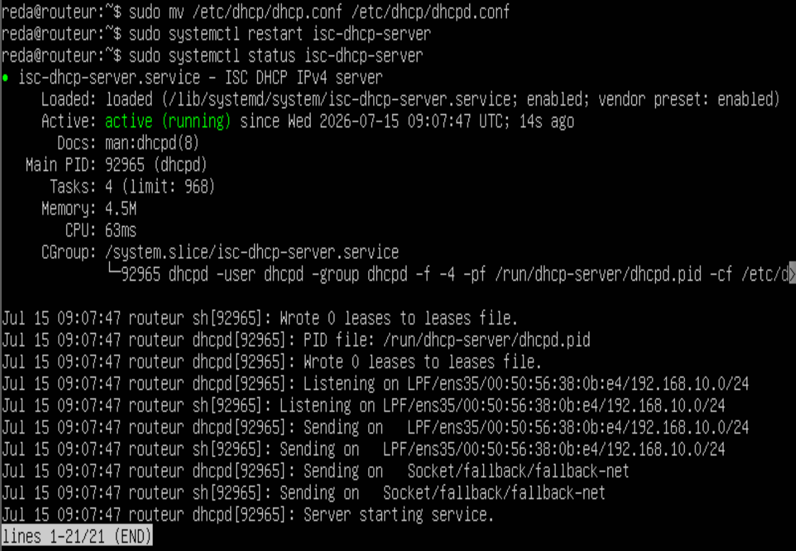
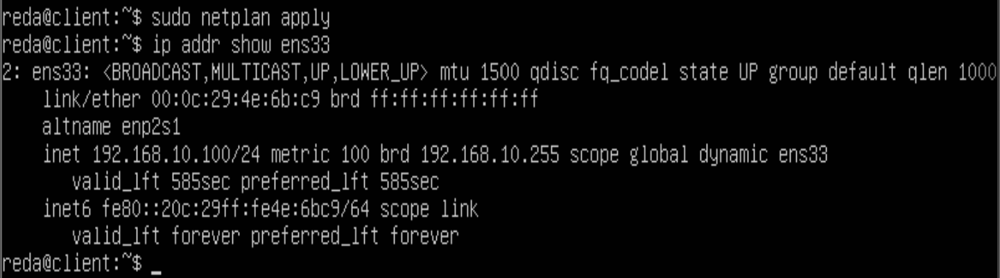
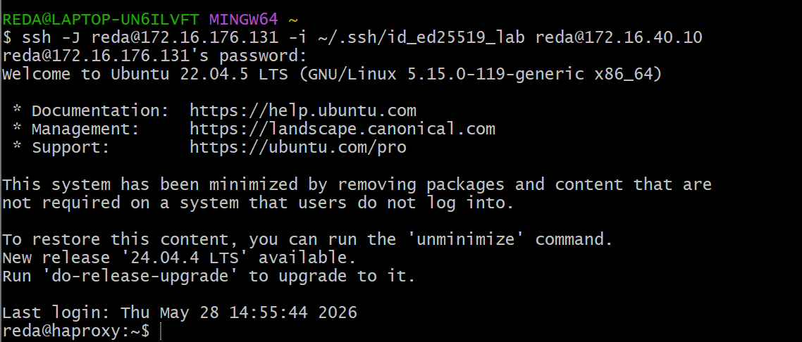
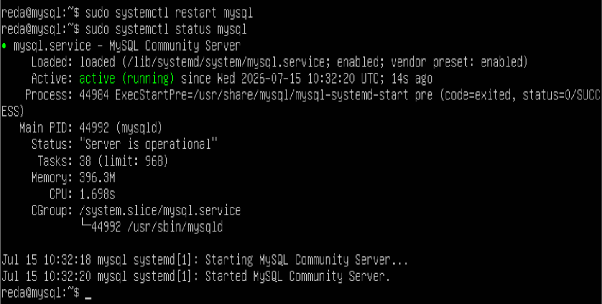
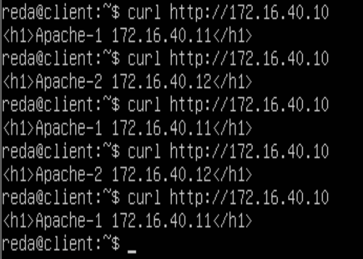
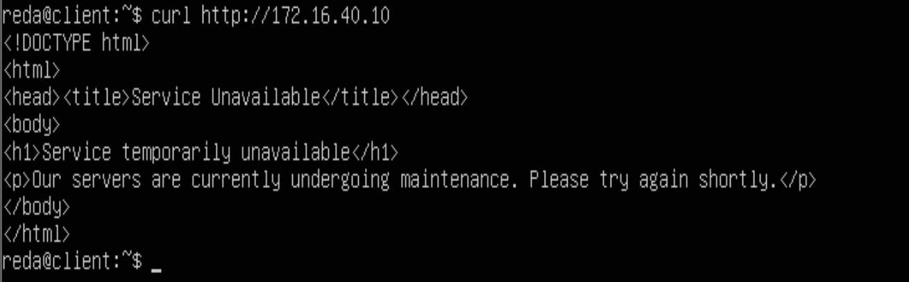
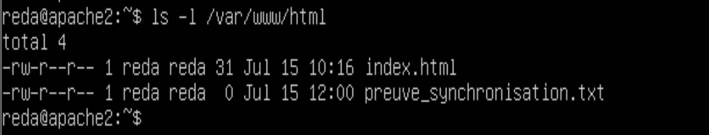

# Phase 04 — Application Services (`deploy_haproxy.sh`)

> Deployment of the complete DMZ application tier: DHCP server, Ed25519 SSH
> authentication, redundant Apache web nodes, isolated MySQL database, HAProxy
> load balancer with active health-checks, and asynchronous content replication
> via rsync. Gate 3 validation.

---

## Table of Contents

- [Objective](#objective)
- [Architecture of the DMZ Application Tier](#architecture-of-the-dmz-application-tier)
- [Implementation](#implementation)
  - [DHCP Server](#1-dhcp-server--router)
  - [SSH Ed25519 Authentication](#2-ssh-ed25519-authentication)
  - [Apache Web Nodes](#3-apache-web-nodes--apache-1-and-apache-2)
  - [MySQL Database](#4-mysql-database--mysql-vm)
  - [HAProxy Load Balancer](#5-haproxy-load-balancer--haproxy-vm)
  - [rsync Content Synchronization](#6-rsync-content-synchronization)
- [Deployment Automation](#deployment-automation)
- [Challenges and Resolutions](#challenges-and-resolutions)
- [Gate 3 Validation](#gate-3-validation)
- [Outcome](#outcome)

---

## Objective

Consolidate the DMZ trust zone by deploying a highly available, fault-tolerant, and
self-replicating web architecture. This phase delivers the full application tier of
the infrastructure: a single load-balanced entry point (HAProxy), two redundant Apache
nodes with synchronized content, and an isolated MySQL backend — all automated through
an idempotent Bash script and fully integrated into the existing firewall policy from
Phase 03.

---

## Architecture of the DMZ Application Tier

```
Internet / Clients zone
         |
         | TCP 80, 443 (authorized by firewall.sh — Phase 03)
         ▼
  ┌─────────────────────┐
  │   HAProxy  .10      │  ← sole public entry point
  │   round-robin       │
  │   health-check 4s   │
  └────────┬────────────┘
           |
     ┌─────┴──────┐
     ▼            ▼
┌─────────┐  ┌─────────┐
│Apache-1 │  │Apache-2 │   rsync every 5 min (Apache-1 → Apache-2)
│  .11    │  │  .12    │   content synchronization via HAProxy cron
└────┬────┘  └─────────┘
     |
     | TCP 3306 (only authorized DMZ → Servers flow)
     ▼
┌─────────────────────┐
│  MySQL 8.0   .10    │   zone: Internal Servers (192.168.20.0/24)
└─────────────────────┘
```

| Node | Hostname | IP | Zone | Role |
|---|---|---|---|---|
| Load balancer | haproxy | 172.16.40.10 | DMZ | L7 reverse proxy, health-check, 503 fallback |
| Primary web node | apache-1 | 172.16.40.11 | DMZ | Apache HTTP Server, content source |
| Secondary web node | apache-2 | 172.16.40.12 | DMZ | Apache HTTP Server, rsync target |
| Database | mysql | 192.168.20.10 | Internal Servers | MySQL 8.0, isolated backend |
| Client | client | DHCP .100–.200 | Clients | User workstation, test origin |

---

## Implementation

### 1. DHCP Server — Router

The router serves as the DHCP server for the Clients zone (192.168.10.0/24), replacing
the temporary static IP assigned to the Client VM in Phase 01.

**Installation and interface binding:**

```bash
sudo apt install -y isc-dhcp-server
```

`/etc/default/isc-dhcp-server`:
```
INTERFACESv4="ens35"
```

`/etc/dhcp/dhcpd.conf`:
```
default-lease-time 600;
max-lease-time 7200;
authoritative;

subnet 192.168.10.0 netmask 255.255.255.0 {
    range 192.168.10.100 192.168.10.200;
    option routers 192.168.10.254;
    option domain-name-servers 8.8.8.8, 1.1.1.1;
    option subnet-mask 255.255.255.0;
}
```

```bash
sudo systemctl enable --now isc-dhcp-server
```

**Validation — DHCP server active on router (T-03):**



**Client VM Netplan updated to DHCP:**

`/etc/netplan/00-installer-config.yaml` on the client VM (replaces the temporary
static address from Phase 01):

```yaml
network:
  version: 2
  renderer: networkd
  ethernets:
    ens33:
      dhcp4: true
```

**Validation — Client receives IP via DHCP:**



---

### 2. SSH Ed25519 Authentication

Ed25519 key pairs are generated on the administrator's host machine and distributed
to all VMs, establishing the asymmetric authentication infrastructure required by BF-04.
Internal VMs (mysql, elk) are reached via ProxyJump through the router.

**Key generation (host machine):**

```bash
ssh-keygen -t ed25519 -C "admin@secure-network" -f ~/.ssh/id_ed25519_lab
```

**Distribution to all VMs:**

```bash
# DMZ nodes — directly reachable from host
ssh-copy-id -i ~/.ssh/id_ed25519_lab.pub reda@172.16.40.10   # haproxy
ssh-copy-id -i ~/.ssh/id_ed25519_lab.pub reda@172.16.40.11   # apache-1
ssh-copy-id -i ~/.ssh/id_ed25519_lab.pub reda@172.16.40.12   # apache-2

# Internal nodes — via router as jump host
ssh-copy-id -i ~/.ssh/id_ed25519_lab.pub -J reda@172.16.176.131 reda@192.168.20.10
ssh-copy-id -i ~/.ssh/id_ed25519_lab.pub -J reda@172.16.176.131 reda@192.168.30.10
ssh-copy-id -i ~/.ssh/id_ed25519_lab.pub -J reda@172.16.176.131 reda@192.168.10.100

# Router itself
ssh-copy-id -i ~/.ssh/id_ed25519_lab.pub reda@172.16.176.131
```

> Password authentication remains enabled at this stage as a safety net during
> infrastructure construction. It is structurally disabled in Phase 06 (`hardening.sh`)
> via `PasswordAuthentication no` in the OpenSSH configuration.

**Validation — key-based SSH authentication (T-04):**



---

### 3. Apache Web Nodes — Apache-1 and Apache-2

Apache HTTP Server is deployed identically on both DMZ nodes. Each node serves a
distinct identification page to make round-robin distribution observable during testing.

**Installation (both nodes):**

```bash
sudo apt install -y apache2
sudo systemctl enable --now apache2
```

**Identification pages:**

Apache-1:
```bash
echo "<h1>Apache-1 172.16.40.11</h1>" | sudo tee /var/www/html/index.html
```

Apache-2:
```bash
echo "<h1>Apache-2 172.16.40.12</h1>" | sudo tee /var/www/html/index.html
```

**Version disclosure hardening (T-12 prerequisite):**

`/etc/apache2/conf-available/security.conf` on both nodes:
```
ServerTokens Prod
ServerSignature Off
```

```bash
sudo a2enconf security
sudo systemctl reload apache2
```

Verification:
```bash
curl -I http://172.16.40.11
# Server: Apache  ← version number absent
```

---

### 4. MySQL Database — MySQL VM

MySQL 8.0 is deployed in the Internal Servers zone and bound exclusively to the
internal interface, making it unreachable from any zone other than the DMZ on port
3306 — the sole authorized cross-zone flow from DMZ to Servers (Phase 03 firewall).

**Installation:**

```bash
sudo apt install -y mysql-server
sudo systemctl enable --now mysql
sudo mysql_secure_installation
```

**Interface binding** (`/etc/mysql/mysql.conf.d/mysqld.cnf`):
```
bind-address = 192.168.20.10
```

**Application user creation (accessible from DMZ range only):**

```sql
CREATE DATABASE appdb;
CREATE USER 'appuser'@'172.16.40.%' IDENTIFIED BY 'StrongPassw0rd!';
GRANT ALL PRIVILEGES ON appdb.* TO 'appuser'@'172.16.40.%';
FLUSH PRIVILEGES;
```

```bash
sudo systemctl restart mysql
```

**Validation — MySQL active and bound to internal interface:**



---

### 5. HAProxy Load Balancer — HAProxy VM

HAProxy is the sole public entry point for the DMZ. It operates at Layer 7 (HTTP mode),
distributes incoming requests across the Apache pool in round-robin, monitors node
availability through active health-checks, and returns a custom maintenance page when
the entire pool is unavailable.

**Full configuration:** see [`configs/haproxy/haproxy.cfg`](../configs/haproxy/haproxy.cfg)

**Key parameters:**

| Parameter | Value | Effect |
|---|---|---|
| Algorithm | `roundrobin` | Cyclic, equal-weight distribution |
| Health-check | `GET /` every 4s | HTTP 200 expected |
| `fall 2` | 2 consecutive failures | Node removed after 8s of unresponsiveness |
| `rise 3` | 3 consecutive successes | Node reintegrated after 12s of recovery |
| `errorfile 503` | `/etc/haproxy/errors/503.http` | Custom page when all backends are down |

**HAProxy logs forwarded to ELK** (`/etc/rsyslog.d/49-haproxy.conf`):
```
if $programname == 'haproxy' then @192.168.30.10:514
& stop
```

```bash
sudo systemctl enable haproxy
sudo systemctl restart rsyslog haproxy
```

---

### 6. rsync Content Synchronization

Content consistency between Apache-1 and Apache-2 is maintained through a scheduled
rsync job running on the HAProxy VM. The synchronization uses a transit buffer directory
(`/tmp/web_sync/`) and relies on key-based SSH authentication established between
HAProxy and both Apache nodes.

**HAProxy → Apache-1 and Apache-2 SSH key:**

```bash
# On HAProxy VM
ssh-keygen -t ed25519 -f ~/.ssh/id_ed25519 -N ""
ssh-copy-id -i ~/.ssh/id_ed25519.pub reda@172.16.40.11
ssh-copy-id -i ~/.ssh/id_ed25519.pub reda@172.16.40.12
```

**Cron job** (`crontab -e` on HAProxy):

```
*/5 * * * * rsync -avz --delete reda@172.16.40.11:/var/www/html/ /tmp/web_sync/ \
  && rsync -avz --delete /tmp/web_sync/ reda@172.16.40.12:/var/www/html/
```

The two-phase transfer (Apache-1 → buffer → Apache-2) isolates the source and
destination nodes, avoiding direct node-to-node dependency and maintaining a consistent
intermediate copy on the load balancer.

---

## Deployment Automation

All HAProxy and rsync configuration is encapsulated in `scripts/deploy_haproxy.sh`,
an idempotent Bash script that can be safely re-executed on the HAProxy VM at any time.

**Idempotency guarantees:**
- `apt-get install -y` is a no-op if packages are already installed
- Configuration files are fully overwritten (not appended) on each run
- The cron entry is removed and re-added on each run, preventing duplicate jobs
- All services are restarted regardless of prior state, ensuring configuration is applied

**Deployment:**

```bash
sudo bash /opt/scripts/deploy_haproxy.sh
```

---

## Challenges and Resolutions

**rsync write permissions on the destination node**
The `rsync` operation synchronizes files from Apache-1 to Apache-2 using the `reda`
user account. The Apache document root (`/var/www/html/`) is owned by `root:root` by
default, causing permission errors when rsync attempts to write files. Resolved by
adjusting ownership of the destination directory on Apache-2 to the `reda` user, or
by running rsync with appropriate sudo escalation via `authorized_keys` forced commands.

**HAProxy not starting after configuration changes**
A syntax error in `haproxy.cfg` causes the service to fail silently — `systemctl status`
shows a failed state with a non-descriptive message. HAProxy provides a built-in
configuration validation command that must be run before every service restart:
`haproxy -c -f /etc/haproxy/haproxy.cfg`. This is integrated as a pre-flight check
in the deployment script.

**Cron job duplication on repeated script execution**
Without idempotent handling, each execution of `deploy_haproxy.sh` would append a
new rsync line to the crontab, eventually creating dozens of conflicting concurrent
synchronization jobs. Resolved by removing any existing `web_sync` entry from the
crontab before inserting the new one: `crontab -l | grep -v "web_sync" | crontab -`.

**rsyslog not installed on minimized profile**
The Ubuntu Server minimized profile omits `rsyslog`. HAProxy log forwarding to ELK
requires it. The deployment script installs it explicitly via `apt-get install -y rsyslog`
before writing the `49-haproxy.conf` forwarding rule.

---

## Gate 3 Validation

Gate 3 is defined in the project specification as: *"HAProxy distributes requests;
automatic failover < 10s; rsync OK"*. Three validation scenarios were executed.

### Round-Robin Load Balancing (T-10)

Sequential `curl` requests to the HAProxy virtual IP (172.16.40.10) from the Client VM
confirm strict alternation between Apache-1 (172.16.40.11) and Apache-2 (172.16.40.12):

```bash
for i in $(seq 1 6); do curl -s http://172.16.40.10; done
```



### Fault Tolerance and Custom 503 Page (T-10)

Both Apache nodes are stopped simultaneously to simulate a total backend failure:

```bash
sudo systemctl stop apache2   # executed on both apache-1 and apache-2
```

HAProxy health-checks detect the DOWN state within two consecutive check intervals
(2 × 4s = 8s). Subsequent requests return the custom 503 maintenance page instead of
a connection timeout, confirming that the `errorfile 503` directive is correctly
triggered:



### Content Replication via rsync (T-11)

A witness file (`preuve_synchronisation.txt`) is created on Apache-1 and the rsync
job is triggered. The file listing on Apache-2 confirms that the file was transferred
with correct timestamp and permissions, validating the synchronization pipeline:



---

## Outcome

The DMZ application tier is fully operational and Gate 3 is formally validated:

- DHCP server active on the router — Client VM leases address in .100–.200 range (T-03)
- Ed25519 key authentication established across all 7 VMs (T-04)
- Apache HTTP Server deployed on apache-1 and apache-2 with version disclosure disabled
- MySQL 8.0 active on 192.168.20.10, bound to the internal interface, accessible on port
  3306 from the DMZ only
- HAProxy distributes requests in round-robin with active health-checks every 4 seconds
- Automatic failover confirmed in under 10 seconds when a node fails (T-10)
- Custom HTTP 503 maintenance page served when the entire pool is unavailable
- rsync synchronization validated — content consistent between Apache-1 and Apache-2 (T-11)
- `deploy_haproxy.sh` idempotent — repeated execution produces identical final state

**Gate 3 status: PASSED**

**Next phase:** [Phase 05 — ELK Stack and Centralized Logging (deploy_elk.sh)](phase-05-elk-siem.md)
