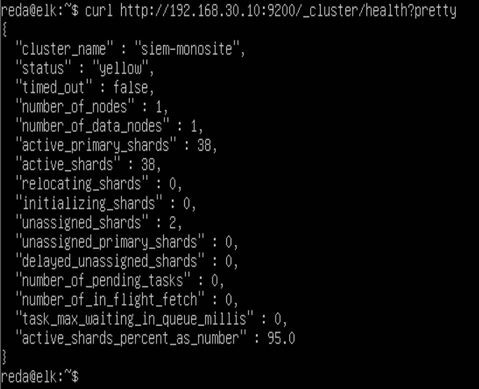
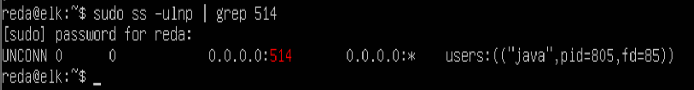
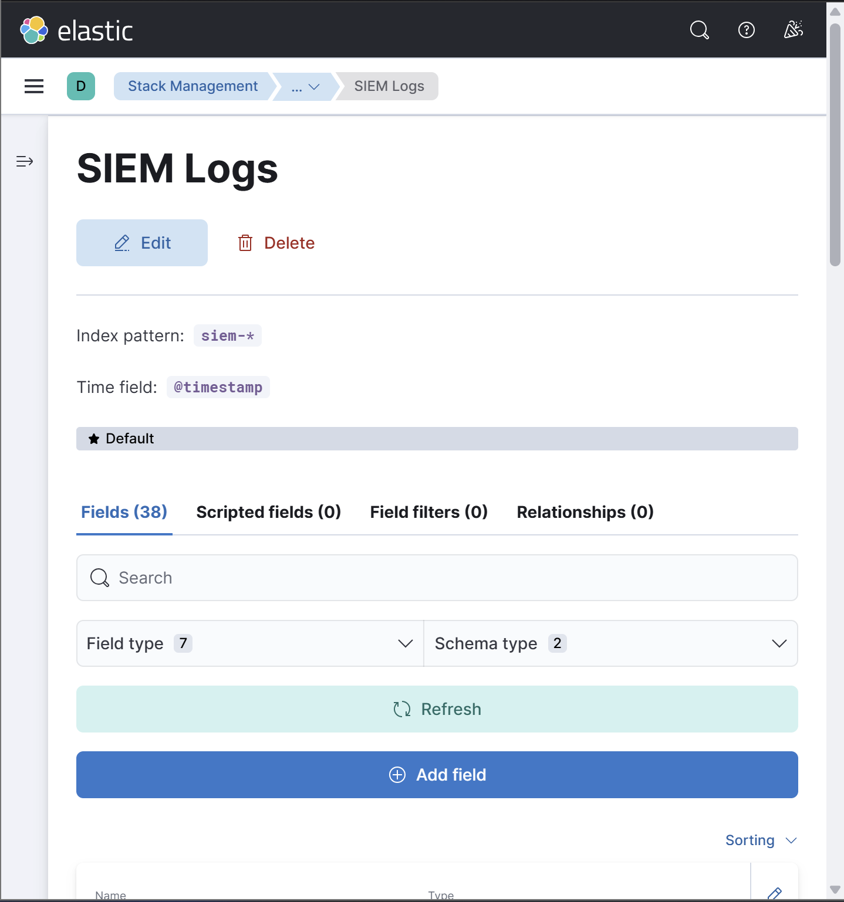
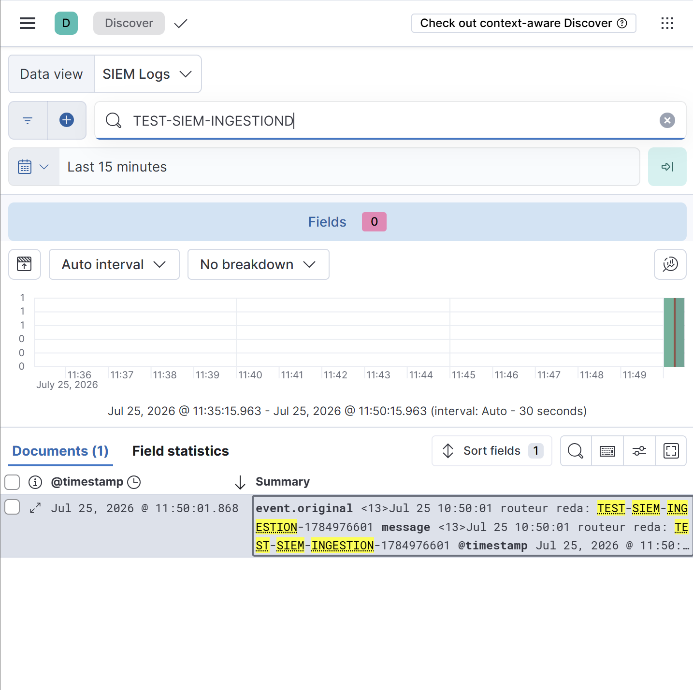
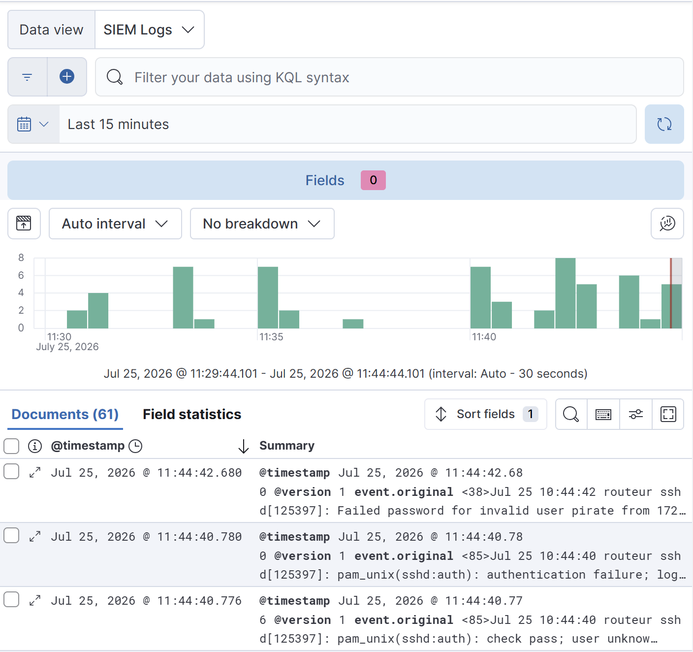
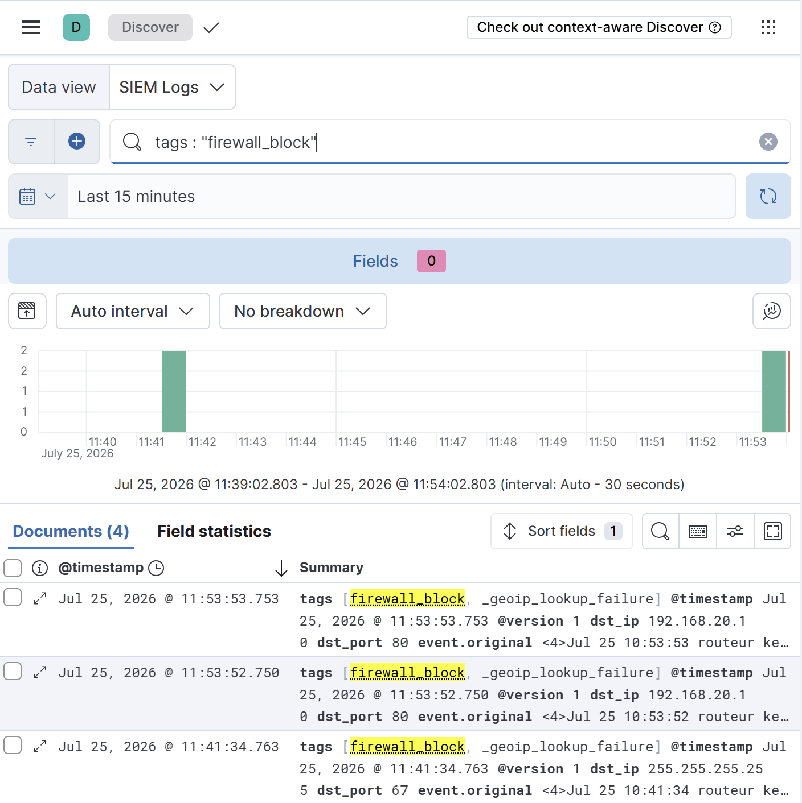

# Phase 05 — Centralized SIEM (`deploy_elk.sh`)

> Deployment of the ELK stack (Elasticsearch, Logstash, Kibana) in the Supervision
> zone, with centralized rsyslog collection, Grok-based log normalization, GeoIP
> enrichment, and near-real-time threat detection. Fulfills security layer 5 of the
> defense-in-depth model.

---

## Table of Contents

- [Objective](#objective)
- [Architecture of the SIEM Pipeline](#architecture-of-the-siem-pipeline)
- [Implementation](#implementation)
  - [Elasticsearch](#1-elasticsearch--storage-and-indexing)
  - [Logstash](#2-logstash--parsing-and-enrichment)
  - [Kibana](#3-kibana--visualization)
  - [rsyslog Forwarding](#4-rsyslog-forwarding--all-vms)
  - [Retention Policy](#5-retention-policy-ilm)
- [Deployment Automation](#deployment-automation)
- [Challenges and Resolutions](#challenges-and-resolutions)
- [Validation](#validation)
- [Outcome](#outcome)

---

## Objective

Deploy a centralized Security Information and Event Management (SIEM) platform based on
the ELK stack to consolidate all audit trails generated across the infrastructure — router
firewall, web servers, database, and load balancer — into a single, isolated collection
point in the Supervision zone. This centralization satisfies the auditability requirement
and enables proactive threat detection with a target mean time to detection (MTTD) under
10 seconds.

The Supervision zone is deliberately isolated from the zones it monitors: audit trails are
stored on a dedicated network segment, protecting log integrity even if a monitored zone
is compromised.

---

## Architecture of the SIEM Pipeline

The processing pipeline follows a complete chain from raw collection to visualization:

```
  All VMs (router, haproxy, apache-1/2, mysql, client)
         │
         │  rsyslog — UDP/514 (authorized by firewall.sh)
         ▼
  ┌──────────────────────────────────────────────────┐
  │              ELK VM  —  192.168.30.10            │
  │                                                  │
  │   ┌──────────┐   ┌──────────────┐   ┌──────────┐ │
  │   │ Logstash │──▶│Elasticsearch │◀──│  Kibana │ │
  │   │ UDP/514  │   │  index       │   │  :5601   │ │
  │   │ Grok     │   │  siem-*      │   │dashboards│ │
  │   │ GeoIP    │   │  30d ILM     │   │          │ │
  │   └──────────┘   └──────────────┘   └──────────┘ │
  └──────────────────────────────────────────────────┘
                         ▲
                         │ SSH tunnel (port 5601 not exposed)
                         │ via router bastion
                    Administrator
```

| Component | Version | Role |
|---|---|---|
| Elasticsearch | 8.x | Full-text indexing and storage of structured events |
| Logstash | 8.x | Grok parsing (iptables, SSH, HAProxy) + GeoIP enrichment |
| Kibana | 8.x | Visualization, dashboards, alerting |
| rsyslog | native | Log collection agent on every VM — UDP/514 forwarding |

---

## Implementation

### 1. Elasticsearch — Storage and Indexing

Elasticsearch is deployed as a single node within the Supervision zone. This choice, while
limiting storage-level fault tolerance, is justified by the sizing constraints of a
single-site virtualized environment and is documented as a known limitation.

**Configuration** ([`configs/elasticsearch/elasticsearch.yml`](../configs/elasticsearch/elasticsearch.yml)):

```yaml
cluster.name: siem-monosite
node.name: elk-node-1
path.data: /var/lib/elasticsearch
path.logs: /var/log/elasticsearch
network.host: 192.168.30.10
http.port: 9200
discovery.type: single-node
xpack.security.enabled: false
```

> **Design decision — X-Pack security disabled.** Elasticsearch 8.x enables TLS and
> authentication by default. For this isolated single-site lab, operating in a dedicated
> and firewall-protected Supervision zone, X-Pack security is disabled to simplify the
> pipeline. This is an assumed, documented choice consistent with the project scope, which
> does not require ELK-level authentication.

**JVM heap sizing** (`/etc/elasticsearch/jvm.options.d/heap.options`):

```
-Xms2g
-Xmx2g
```

Heap is fixed at 2 GB — under 50% of the VM's 5 GB RAM, following Elasticsearch sizing
guidance to leave sufficient memory for the OS filesystem cache.

### 2. Logstash — Parsing and Enrichment

Logstash ingests raw syslog on UDP/514 and transforms unstructured log lines into
discrete, queryable fields using Grok patterns.

**Pipeline** ([`configs/logstash/siem-pipeline.conf`](../configs/logstash/siem-pipeline.conf)):

| Filter | Source | Extracted fields | Tag |
|---|---|---|---|
| iptables | `[FW-BLOCK]` events | src_ip, dst_ip, protocol, dst_port | firewall_block |
| SSH | sshd auth events | ssh_user, auth_method, ssh_src_ip | ssh_auth / ssh_failed |
| HAProxy | haproxy access logs | client_ip, backend, server, http_status | haproxy_access |
| GeoIP | any src_ip | geographic enrichment | — |

### 3. Kibana — Visualization

Kibana provides the analysis interface, bound to the internal Supervision address.

**Configuration** ([`configs/kibana/kibana.yml`](../configs/kibana/kibana.yml)):

```yaml
server.port: 5601
server.host: "192.168.30.10"
elasticsearch.hosts: ["http://192.168.30.10:9200"]
```

A Data View targeting the `siem-*` index pattern was created, recognizing 38 distinct
fields produced by the Logstash normalization process.

### 4. rsyslog Forwarding — All VMs

Every VM in the infrastructure forwards its logs to the ELK collector. The configuration
is identical across all nodes (`/etc/rsyslog.d/50-forward-elk.conf`):

```
*.* @192.168.30.10:514
```

The firewall policy from Phase 03 already authorizes the flow `Any zone → Supervision
(192.168.30.10) on UDP/514`, so no firewall modification is required. The router forwards
its own iptables `[FW-BLOCK]` events through the same mechanism, feeding the firewall_block
Grok filter.

### 5. Retention Policy (ILM)

A 30-day Index Lifecycle Management policy enforces the retention requirement:

```bash
curl -X PUT "http://192.168.30.10:9200/_ilm/policy/siem-retention" \
  -H 'Content-Type: application/json' -d'
{
  "policy": {
    "phases": {
      "hot":    { "actions": {} },
      "delete": { "min_age": "30d", "actions": { "delete": {} } }
    }
  }
}'
```

---

## Deployment Automation

The entire stack — installation, configuration, systemd override, and ILM policy — is
encapsulated in the idempotent [`scripts/deploy_elk.sh`](../scripts/deploy_elk.sh).

**Idempotency guarantees:**
- The Elastic GPG key is only imported if absent
- Configuration files are fully overwritten on each run
- `apt-get install -y` is a no-op if packages are already present
- Services are restarted unconditionally, guaranteeing configuration is applied

```bash
sudo bash /opt/scripts/deploy_elk.sh
```

---

## Challenges and Resolutions

**Privileged port binding — `Permission denied: bind(2) for port 514`**
Logstash's syslog input must bind UDP/514. Ports below 1024 are privileged and require
root capability to bind. However, Logstash runs under its own non-privileged `logstash`
user following the least-privilege principle, causing a fatal bind error at pipeline
startup.

Rather than compromising security by running the service as root, the specific
`CAP_NET_BIND_SERVICE` network capability is granted to the Logstash service through a
clean systemd override ([`configs/logstash/override.conf`](../configs/logstash/override.conf)):

```
[Service]
AmbientCapabilities=CAP_NET_BIND_SERVICE
```

```bash
sudo mkdir -p /etc/systemd/system/logstash.service.d
sudo systemctl daemon-reload
sudo systemctl restart logstash
```

After the JVM initialization delay (~60s), binding to UDP/514 was empirically confirmed
with `sudo ss -ulnp | grep 514`, showing the Java process bound in UNCONN mode. This is
the most rigorous and permanent resolution — it grants exactly one capability without
elevating the entire service to root.

**Securing Kibana access — SSH tunnel instead of firewall exposure**
The Kibana interface (port 5601) is not exposed to any external network. Rather than
opening TCP/5601 in the firewall — which would weaken the security posture — access is
provided through an SSH local port-forwarding tunnel via the router acting as a bastion
host:

```bash
ssh -L 5601:192.168.30.10:5601 reda@172.16.176.131
```

The administrator then reaches Kibana at `localhost:5601`. All administration traffic to
the Supervision zone is systematically encrypted and authenticated before crossing into
the critical zone, preserving the isolation model.

**Elasticsearch bootstrap — `vm.max_map_count`**
Elasticsearch requires the kernel parameter `vm.max_map_count` set to at least 262144 to
allocate memory-mapped files. Below this threshold, Elasticsearch fails its bootstrap
checks and refuses to start. The parameter is set persistently via
`/etc/sysctl.d/99-elasticsearch.conf` in the deployment script.

**Service startup ordering**
Logstash and Kibana both depend on Elasticsearch being ready. Starting them before
Elasticsearch has initialized causes connection failures. The deployment script inserts
a 30-second delay after starting Elasticsearch before starting the dependent services.

---

## Validation

Three end-to-end validation scenarios were executed to certify the SIEM chain.

### Elasticsearch Cluster Health

```bash
curl http://192.168.30.10:9200/_cluster/health?pretty
```

The cluster reports `"status": "yellow"` with 38 active primary shards. Yellow status is
expected and correct for a single-node deployment (replica shards remain unassigned with
no second node to host them) — it confirms successful primary shard allocation and a fully
operational search engine.



### Logstash Syslog Listener

```bash
sudo ss -ulnp | grep 514
```

The Java process is bound to UDP/514 in UNCONN mode, confirming the successful application
of the `CAP_NET_BIND_SERVICE` systemd exception.



### Kibana Access via SSH Tunnel

Kibana is reached at `localhost:5601` through the SSH tunnel, demonstrating secure
zone traversal without exposing the port.


### Data View Normalization

The `siem-*` Data View recognizes 38 distinct fields produced by the Logstash Grok
normalization, confirming that raw logs are correctly parsed into structured, queryable
data.



### Ingestion Pipeline (T-07)

A test log generated with `logger` on a source VM appears in Kibana Discover in under
15 seconds, confirming the responsiveness of the rsyslog → Logstash → Elasticsearch chain.



### SSH Failure Detection (T-08)

A simulated SSH brute-force attempt is correctly recognized by Logstash (pam_unix failure format). The event surfaces in Discover with the invalid username and source IP extracted.The MTTD is under 10 seconds, satisfying the T-08 requirement.



### Firewall Block Correlation

An unauthorized flow blocked by the router firewall triggers the specific `[FW-BLOCK]`
Grok filter. Critical fields (src_ip, dst_ip, dst_port) are successfully isolated — the
example shows `dst_ip: 192.168.20.10` and `dst_port: 80` extracted from a raw kernel log,
enabling future automated correlation.



---

## Outcome

The centralized SIEM is fully operational:

- Elasticsearch active on 192.168.30.10:9200 — single-node cluster, 38 primary shards
- Logstash bound to UDP/514 via CAP_NET_BIND_SERVICE — least-privilege port binding
- Kibana accessible through SSH tunnel — port 5601 never exposed
- rsyslog forwarding configured on all 6 monitored VMs plus the router
- Grok parsing operational for iptables [FW-BLOCK], SSH, and HAProxy events
- GeoIP enrichment active on source IPs
- Test log ingestion confirmed in under 15 seconds (T-07)
- SSH failure detection and firewall block correlation validated, MTTD under 10 seconds (T-08)
- 30-day ILM retention policy applied
- `deploy_elk.sh` idempotent — repeated execution produces identical final state

Security layer 5 (centralized supervision) of the defense-in-depth model is complete.

**Next phase:** [Phase 06 — System Hardening (hardening.sh)](phase-06-hardening.md)
