# Phase 06 — System Hardening (`hardening.sh`)

> OS-level hardening across all seven VMs: key-only SSH authentication,
> Fail2ban brute-force protection, CIS Benchmark kernel parameters with
> role-aware differentiation, and Lynis compliance auditing. Implements
> security layers 3 and 4 of the defense-in-depth model.

---

## Table of Contents

- [Objective](#objective)
- [Hardening Layers](#hardening-layers)
- [Implementation](#implementation)
  - [SSH — Key-Only Authentication](#1-ssh--key-only-authentication)
  - [Fail2ban — Brute-Force Protection](#2-fail2ban--brute-force-protection)
  - [Account Policy and System Limits](#3-account-policy-and-system-limits)
  - [CIS Kernel Parameters](#4-cis-kernel-parameters)
  - [Module Blocklist and File Permissions](#5-module-blocklist-and-file-permissions)
- [Role-Aware Hardening — Router vs Endpoint Servers](#role-aware-hardening--router-vs-endpoint-servers)
- [Challenges and Resolutions](#challenges-and-resolutions)
- [Validation](#validation)
- [Outcome](#outcome)

---

## Objective

Harden every node of the infrastructure at the operating system level, applying
defense-in-depth principles beyond the network layer. This phase locks down remote
access, deploys active brute-force protection, and tunes kernel parameters to resist
denial-of-service and spoofing attacks — while preserving the router's legitimate
packet-forwarding role.

The entire process is automated through the idempotent
[`scripts/hardening.sh`](../scripts/hardening.sh), ensuring homogeneous and
reproducible hardening across the fleet.

---

## Hardening Layers

| Layer | Control | Implementation |
|---|---|---|
| Remote access | Asymmetric authentication only | `PasswordAuthentication no`, `PermitRootLogin no`, Ed25519 keys |
| Intrusion response | Automatic banning | Fail2ban — 3 failures / 600s window, 600s ban |
| Account policy | Password aging, restrictive umask | `PASS_MAX_DAYS 90`, `UMASK 027` |
| Kernel — network | Spoofing and DoS resistance | SYN cookies, rp_filter, redirect rejection (role-dependent) |
| Kernel — system | Memory and privilege restrictions | `kptr_restrict`, `dmesg_restrict`, `suid_dumpable`, BPF hardening |
| Attack surface | Module blocklist | Rare filesystems and protocols disabled at modprobe level |
| Compliance | Continuous audit | Lynis CIS Benchmark Ubuntu 22.04 |

---

## Implementation

### 1. SSH — Key-Only Authentication

Password authentication is structurally disabled at the OpenSSH configuration level —
not merely discouraged by policy. Access is exclusively through Ed25519 key pairs
distributed in Phase 04.

```
PasswordAuthentication no
PermitRootLogin no
PubkeyAuthentication yes
X11Forwarding no
MaxAuthTries 3
AllowTcpForwarding no
ClientAliveCountMax 2
Compression no
LogLevel VERBOSE
```

> **Cloud-init drop-in neutralization.** Ubuntu 22.04 ships drop-in configuration
> files under `/etc/ssh/sshd_config.d/` that can silently re-enable password
> authentication and override the main config. The script neutralizes them before
> editing `sshd_config`, guaranteeing the directive actually takes effect.

`LogLevel VERBOSE` is deliberate: it produces the detailed authentication failure
entries that Fail2ban relies on for detection.

The configuration is validated with `sshd -t` before the service restart — a syntax
error aborts the script rather than leaving SSH unable to start.

### 2. Fail2ban — Brute-Force Protection

Fail2ban monitors `/var/log/auth.log` and issues dynamic iptables DROP rules against
attacking sources.

**Configuration** ([`configs/fail2ban/jail.local`](../configs/fail2ban/jail.local)):

| Parameter | Value | Effect |
|---|---|---|
| `maxretry` | 3 | Ban triggered after 3 failed attempts |
| `findtime` | 600 | Rolling detection window (seconds) |
| `bantime` | 600 | Ban duration (seconds) |
| `banaction` | iptables-multiport | Dynamic iptables rule injection |
| `mode` | aggressive | Matches invalid-user and failed-publickey events |
| `ignoreip` | internal subnets | Prevents administrator self-lockout |

Customization is written to `jail.local` rather than `jail.conf` — the latter is
overwritten by package updates, while `jail.local` takes precedence and persists.

### 3. Account Policy and System Limits

```
PASS_MAX_DAYS 90     # password rotation ceiling
PASS_MIN_DAYS 1      # prevents immediate re-change cycling
UMASK 027            # new files not world-readable by default
```

Core dumps are disabled (`* hard core 0`) to prevent memory contents — potentially
containing credentials — from being written to disk on process crash. A legal warning
banner is set in both `/etc/issue` (console) and `/etc/issue.net` (pre-authentication
SSH).

### 4. CIS Kernel Parameters

Network parameters are applied conditionally based on node role (see the next section).
System-level parameters are applied uniformly across all VMs:

```
kernel.sysrq = 0                      # disable magic SysRq key
kernel.kptr_restrict = 2              # hide kernel pointers from userspace
kernel.dmesg_restrict = 1             # restrict kernel log access to root
kernel.unprivileged_bpf_disabled = 1  # block unprivileged BPF program loading
net.core.bpf_jit_harden = 2           # harden the BPF JIT compiler
fs.suid_dumpable = 0                  # no core dumps from setuid binaries
```

### 5. Module Blocklist and File Permissions

Rare filesystems and network protocols are neutralized at the modprobe level, removing
them as potential attack vectors: `dccp`, `sctp`, `usb-storage`, `cramfs`, `freevxfs`,
`jffs2`, `hfs`, `hfsplus`, `squashfs`, `udf`.

Sensitive file permissions are enforced: `sshd_config` (600), `passwd` (644),
`shadow` (640).

---

## Role-Aware Hardening — Router vs Endpoint Servers

Applying CIS network parameters uniformly would break the infrastructure. Several
directives that are correct for an endpoint server are actively harmful on a node whose
purpose is forwarding traffic between zones. The script resolves this with a
`ROUTER_MODE` conditional flag.

| Kernel parameter | Router (`yes`) | Endpoint servers (`no`) | Architectural rationale |
|---|---|---|---|
| `tcp_syncookies` | Active (1) | Active (1) | Universal protection — prevents resource exhaustion during SYN flood attacks |
| `rp_filter` | Active (1) | Active (1) | Reverse path filtering protects against IP spoofing. Initially excluded from the router branch on the assumption that it would reject legitimate asymmetric inter-zone traffic; empirical testing proved otherwise on this topology (see below) |
| `accept_redirects` | Not applied | Disabled (0) | An endpoint must never accept ICMP redirects (traffic hijacking vector). Computing and managing routes is precisely the router's role |
| `accept_source_route` | Not applied | Disabled (0) | Source routing — where the sender dictates the path instead of the routing table — is an attack vector on endpoints. The router retains native behavior for complex flow handling |
| `log_martians` | Not applied | Active (1) | Servers log impossible source addresses. The router legitimately receives atypical traffic on its transit interfaces and is exempted to avoid log saturation |
| `icmp_echo_ignore_broadcasts` | Active (1) | Active (1) | Universal — prevents Smurf amplification attacks |

This conditional logic ensures that security does not come at the expense of network
availability. The router is hardened against attacks that target it directly — brute
force, SYN flood, spoofing — while its forwarding functions remain fully intact.

### Empirical validation of `rp_filter` on the router

Strict Reverse Path Filtering drops a packet when the return route to its source address
does not exit through the interface the packet arrived on. The conventional guidance is
to disable it on routers, because multi-path or failover topologies commonly produce
legitimate asymmetric routing that strict RPF would reject.

This topology does not exhibit that asymmetry. Each zone is a single subnet attached to
a single dedicated router interface, so exactly one return path exists per source:

| Source zone | Ingress interface | Return path egress | Symmetric |
|---|---|---|---|
| Clients — 192.168.10.0/24 | ens35 | ens35 | yes |
| DMZ — 172.16.40.0/24 | ens34 | ens34 | yes |
| Internal Servers — 192.168.20.0/24 | ens36 | ens36 | yes |
| Supervision — 192.168.30.0/24 | ens37 | ens37 | yes |

Strict RPF therefore never encounters an asymmetry to reject. Full inter-zone
connectivity was verified from the Client VM with `rp_filter = 1` active on the router:
ICMP to all three remote zones returned 0% packet loss, and the end-to-end application
flow through HAProxy to the Apache backend returned correctly.

Since the parameter provides genuine anti-spoofing value and is demonstrably compatible
with the architecture, it is retained on the router rather than removed to match the
original design assumption.

> **Forward dependency.** The planned Keepalived/VRRP high-availability evolution
> introduces a second router and a floating virtual IP, which can produce genuinely
> asymmetric return paths. `rp_filter` must be re-evaluated — and likely relaxed to
> loose mode (`2`) or disabled — before that change is deployed.

---

## Challenges and Resolutions

**Conflict between SSH restriction and Fail2ban detection**

With `PasswordAuthentication no` in effect, the SSH daemon rejects connection attempts
before reaching the full authentication phase. The classic `Failed password` log line —
which the default Fail2ban `sshd` filter matches on — is therefore never produced. A
conventional dictionary attack generates no bannable events, leaving Fail2ban silent
despite an active attack.

The resolution was twofold: enabling `mode = aggressive` in the sshd jail, which
extends matching to invalid-user and failed-publickey events, and adapting the offensive
test methodology. Instead of password-based brute forcing, tests generate connection
attempts with invalid usernames and incorrect cryptographic keys, forcing the SSH daemon
to log critical authentication errors that Fail2ban successfully matches and acts upon.

This is a genuine consequence of layered hardening: strengthening one control changed
the observable signature the next control depends on. Both layers had to be reconciled.

**Whitelist blocking the offensive validation**

During attack simulation, Fail2ban correctly detected the malicious pattern but declined
to apply the ban — the Client VM's address belonged to a subnet declared in
`TRUSTED_NET`. The whitelist was doing exactly its job.

The subnet `192.168.10.0/24` was temporarily removed from `ignoreip` for the duration of
the test, then immediately restored after validation. This illustrates a real operational
principle: test networks must be isolated from trusted networks, and the whitelist that
protects the administrator in production is the same mechanism that must be lifted to
validate the control.

**Routing integrity under CIS hardening**

Blind application of CIS network parameters — particularly `accept_redirects = 0` and
`rp_filter = 1` — broke network connectivity when applied to the node acting as router.
The conditional `ROUTER_MODE` logic described above resolves this by role, granting the
router only the protections that do not impede its transit function.

---

## Validation

### Key-Based SSH Access (T-04)

Ed25519 key authentication verified across all six target VMs via the router bastion.
Each connection succeeds without a password prompt on the destination host.

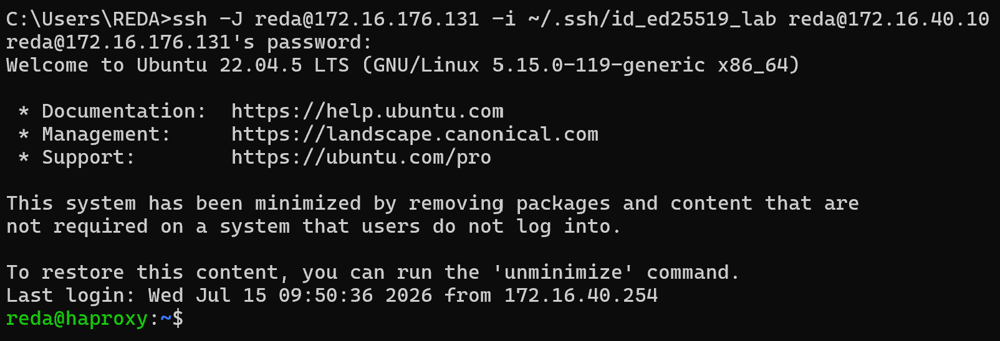

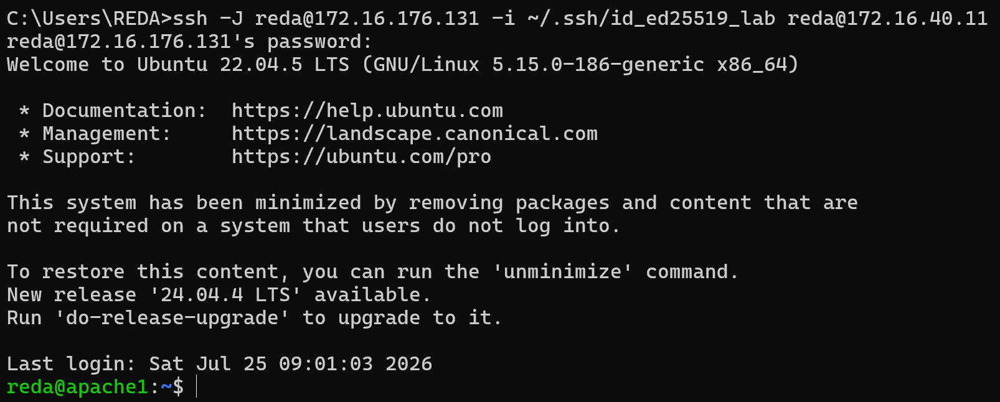

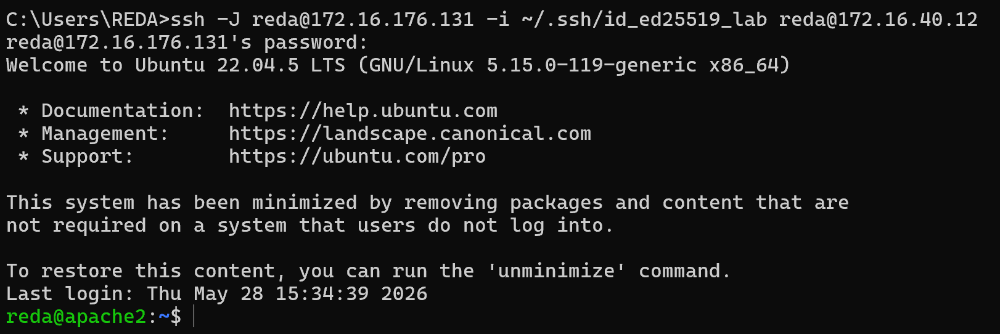

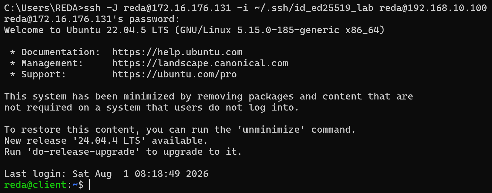

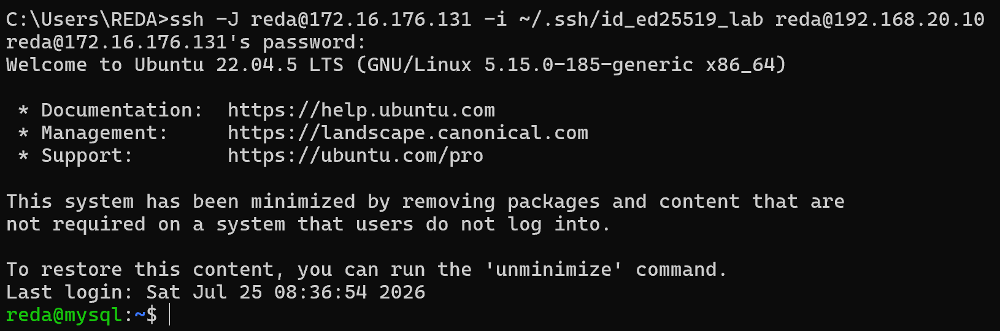

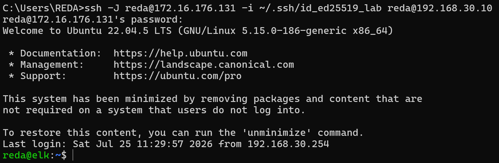

### Password Authentication Rejection (T-05)

Forcing a password-based connection with `-o PubkeyAuthentication=no` is systematically
rejected by the server with `Permission denied (publickey)`, confirming that password
authentication is structurally impossible rather than merely discouraged.

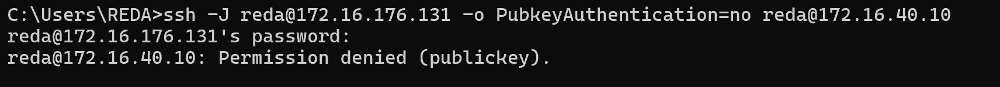

### CIS Network Parameters Applied

Full CIS network ruleset applied on an endpoint server, showing all eight directives
taking effect.

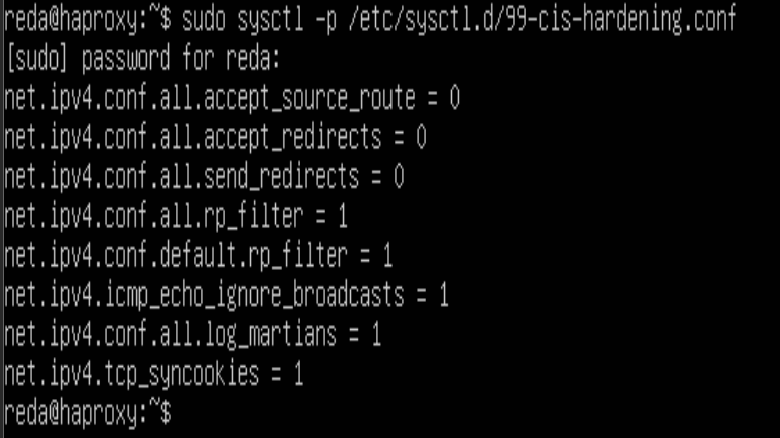

### SYN Flood Protection — Both Roles

`tcp_syncookies` is verified active on both node types, confirming that the universal
protection is applied regardless of `ROUTER_MODE`.

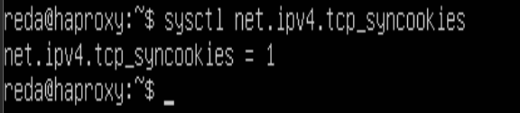

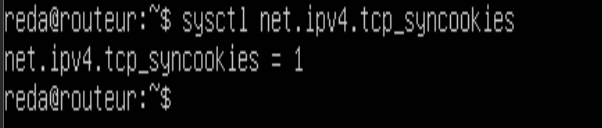

### Lynis Compliance Audit

The Lynis system audit returns a **Hardening Index of 73**, exceeding the project target
of 70 and confirming CIS Benchmark alignment post-deployment.

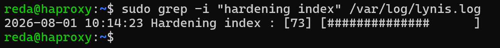

---

## Outcome

OS-level hardening is complete across the infrastructure:

- SSH password authentication structurally disabled on all VMs — Ed25519 keys only (T-05)
- Key-based access verified on all six target VMs via the router bastion (T-04)
- Fail2ban active with aggressive-mode sshd jail — 3 failures / 600s window, 600s ban
- Administrator whitelist configured, preventing self-lockout during normal operation
- CIS kernel parameters applied with role-aware differentiation via `ROUTER_MODE`
- SYN cookie protection confirmed active on both router and endpoint servers
- Strict reverse path filtering retained on the router after empirical validation of
  full inter-zone connectivity — flagged for re-evaluation before Keepalived/VRRP
- Rare filesystems and network protocols disabled at modprobe level
- Account policy enforced: 90-day password ceiling, `UMASK 027`, core dumps disabled
- Lynis Hardening Index: **73 / 100** (target: above 70)
- `hardening.sh` idempotent — repeated execution produces identical final state

Security layers 3 (asymmetric authentication) and 4 (automated intrusion response) of
the defense-in-depth model are complete.

**Next phase:** [Phase 07 — AWS Cloud Deployment](phase-07-aws-deployment.md)
